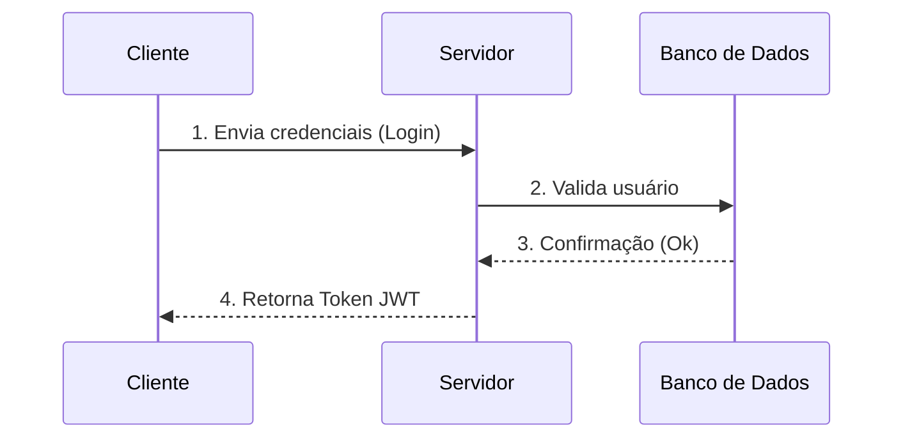
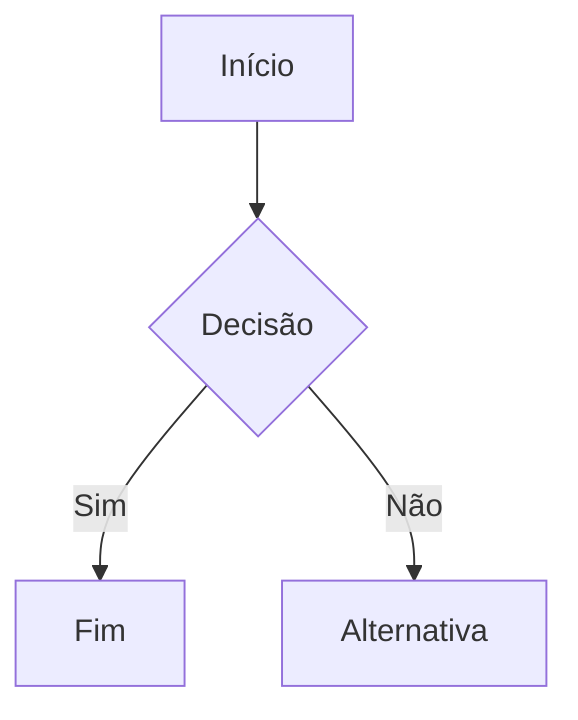

 # Guia Markdown
Guia da sintaxe markdown.

Markdown é uma linguagem simples de marcação de texto.


## Headers
É possível usar até 6 tamanhos hierárquicos de fonte de título.

# Título 1
## Título 2
### Título 3
#### Título 4
##### Título 5
###### Título 6


## Quebra de linha no Parágrafo
Dá pra fazer tanto com a tag do HTML quanto adicionando dois espaços em branco onde se quer quebrar.<br>
Espaçamento entre parágrafos: apertar Enter duas vezes no final do parágrafo.


## Listas
É possível fazer listas das duas formas a seguir.

### Forma 1
Lista não-ordenada:
 * Item
 * Item
 * Item

Pode ser feita com *, - ou +.
 
### Forma 2
Lista ordenada:
1. Item
2. Item
3. Item

### Mesclada
Lista com tipos de ordenação mesclados:
- Item
- Item
  1. Primeiro
  2. Segundo
- Item
  + Teste1
  + Teste2

## Ênfase - Estilo do Texto
É possível utilizar os destaques de texto abaixo. <br/>
_Texto em Itálico_ <br/>
**Texto em Negrito** <br/>
__Texto em Negrito__ <br/>
~~Texto Tachado~~<br/>
**_Texto em Itálico e Negrito_** <br/>
***Texto em Itálico e Negrito*** <br/>
<sub>Subscrito</sub> <br/>
<sup>Sobrescrito</sup> <br/>
> Texto citação


## Blockquotes
 > Sea of Stars é um dos jogos mais lindos que eu já joguei.
 >
 > Elden Ring é o próximo da lista.
 >
 >> Gosto de RPG de turno!

## Links
Esse usuário tem uma [página](https://dekomonte.github.io/).


## Lista de Tarefas
É possível colocar uma lista de tarefas. <br/>
- [x] Tarefa 1
- [ ] Tarefa 2
- [ ] Tarefa 3


## Emoji
É possível adicionar emojis aos projeto. <br/>
:metal: <br/>
:video_game: </br>
:owl: <br/>
:rainbow: <br/>
:musical_note: <br/>
:sunglasses: <br/>


## Linhas Horizontais
3* ou 3-

***
---

## Imagens
É possível colocar imagens no texto tanto usando um arquivo local quanto uma URL externa. <br/>


***
## Tabelas
Exemplos de tabelas:

| Nome | Idade |
| ----- | ------ |
| Andressa | 26 |
| Álvaro | 22 |

| Nome | Idade | Profissão |
| ----- | ------ | ----- |
| Andressa | 26 | Engenharia |
| Álvaro | 22 | Medicina |

Alinhamentos:

| Nome | Idade | Profissão |
| :----- | :------: | -----: |
| Andressa | 26 | Engenharia |
| Álvaro | 22 | Medicina |


## Blocos de Código
É possível destacar trechos de código o trecho entre 3`.

Exemplo:
Informe os parâmetros `usuario` e `senha` para a função `login()`.

```
int idade1 = 26;
int idade2 = 20;

print(idade1);
print(idade2);
```

```python
int idade1 = 26
int idade2 = 20

print(idade1)
print(idade2)
```

## Mermaid diagrams


